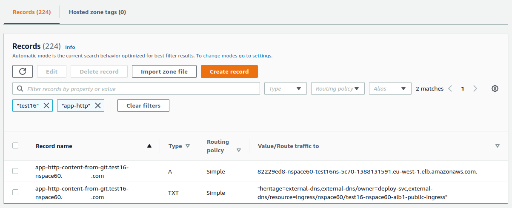

# aws-eks-vpc-3priv-3pub-3db-3front-sn

EKS with nodes groups stacks in private subnets only. VPC: 3 available zones; 3 private, 3 public, 3 db and 3 front subnets.

Load Balancer is in public subnets.

EKS nodes are in private subnets.

## Environment name

test16

## Diagram


## VPC Subnets:
```bash
SUBNET_ID="16"

VpcBlock 10.${SUBNET_ID}.0.0/16

SubnetPublicAblock=10.${SUBNET_ID}.0.0/20
SubnetPublicBblock=10.${SUBNET_ID}.16.0/20
SubnetPublicCblock=10.${SUBNET_ID}.32.0/20

SubnetFrontAblock=10.${SUBNET_ID}.64.0/22
SubnetFrontBblock=10.${SUBNET_ID}.68.0/22
SubnetFrontCblock=10.${SUBNET_ID}.72.0/22

SubnetDbAblock=10.${SUBNET_ID}.96.0/22
SubnetDbBblock=10.${SUBNET_ID}.100.0/22
SubnetDbCblock=10.${SUBNET_ID}.104.0/22

SubnetPrivateAblock=10.${SUBNET_ID}.128.0/19
SubnetPrivateBblock=10.${SUBNET_ID}.160.0/19
SubnetPrivateCblock=10.${SUBNET_ID}.192.0/19
```

## EKS nodes groups

EKS nodes groups:
```
main
nspace60
```

main is for Kubernetes core service pods.

nspace60 is for our websites test pods.

We could scale main and websites groups individually.

## Variables, Configuration

Configuration is in init.sh file.

## Sensitive information and credentials are in AWS Parameter Store

## Usage

It is as simple as:
```bash
. ~/venv-aws-cli/bin/activate
export COMPANY_NAME_SHORT="abc" && export ENV_TYPE="test" && export IP_2ND_OCTET="16" && export NSPACE="nspace60" && export APP_NAME="app-http-content-from-git" && export CI_CD_DEPLOY=false && bash -c "./bin/deploy-env-full.sh"
```

After ~ 28 minutes you will see all Workers as **Ready**:
```bash
$ kubectl get nodes
NAME                                          STATUS   ROLES    AGE   VERSION
ip-10-16-143-148.eu-west-1.compute.internal   Ready    <none>   77m   v1.18.9-eks-d1db3c
ip-10-16-183-113.eu-west-1.compute.internal   Ready    <none>   90m   v1.18.9-eks-d1db3c
ip-10-16-200-214.eu-west-1.compute.internal   Ready    <none>   77m   v1.18.9-eks-d1db3c
ip-10-16-222-192.eu-west-1.compute.internal   Ready    <none>   91m   v1.18.9-eks-d1db3c

$ kubectl get nodes --show-labels
NAME                                          STATUS   ROLES    AGE   VERSION              LABELS
ip-10-16-143-148.eu-west-1.compute.internal   Ready    <none>   77m   v1.18.9-eks-d1db3c   beta.kubernetes.io/arch=amd64,beta.kubernetes.io/instance-type=t3.xlarge,beta.kubernetes.io/os=linux,failure-domain.beta.kubernetes.io/region=eu-west-1,failure-domain.beta.kubernetes.io/zone=eu-west-1a,kubernetes.io/arch=amd64,kubernetes.io/hostname=ip-10-16-143-148.eu-west-1.compute.internal,kubernetes.io/os=linux,node.kubernetes.io/instance-type=t3.xlarge,nodesgroup=nspace60,topology.kubernetes.io/region=eu-west-1,topology.kubernetes.io/zone=eu-west-1a
ip-10-16-183-113.eu-west-1.compute.internal   Ready    <none>   91m   v1.18.9-eks-d1db3c   beta.kubernetes.io/arch=amd64,beta.kubernetes.io/instance-type=t3a.small,beta.kubernetes.io/os=linux,failure-domain.beta.kubernetes.io/region=eu-west-1,failure-domain.beta.kubernetes.io/zone=eu-west-1b,kubernetes.io/arch=amd64,kubernetes.io/hostname=ip-10-16-183-113.eu-west-1.compute.internal,kubernetes.io/os=linux,node.kubernetes.io/instance-type=t3a.small,nodesgroup=main,topology.kubernetes.io/region=eu-west-1,topology.kubernetes.io/zone=eu-west-1b
ip-10-16-200-214.eu-west-1.compute.internal   Ready    <none>   77m   v1.18.9-eks-d1db3c   beta.kubernetes.io/arch=amd64,beta.kubernetes.io/instance-type=t3.xlarge,beta.kubernetes.io/os=linux,failure-domain.beta.kubernetes.io/region=eu-west-1,failure-domain.beta.kubernetes.io/zone=eu-west-1c,kubernetes.io/arch=amd64,kubernetes.io/hostname=ip-10-16-200-214.eu-west-1.compute.internal,kubernetes.io/os=linux,node.kubernetes.io/instance-type=t3.xlarge,nodesgroup=nspace60,topology.kubernetes.io/region=eu-west-1,topology.kubernetes.io/zone=eu-west-1c
ip-10-16-222-192.eu-west-1.compute.internal   Ready    <none>   91m   v1.18.9-eks-d1db3c   beta.kubernetes.io/arch=amd64,beta.kubernetes.io/instance-type=t3a.small,beta.kubernetes.io/os=linux,failure-domain.beta.kubernetes.io/region=eu-west-1,failure-domain.beta.kubernetes.io/zone=eu-west-1c,kubernetes.io/arch=amd64,kubernetes.io/hostname=ip-10-16-222-192.eu-west-1.compute.internal,kubernetes.io/os=linux,node.kubernetes.io/instance-type=t3a.small,nodesgroup=main,topology.kubernetes.io/region=eu-west-1,topology.kubernetes.io/zone=eu-west-1c
```

## Application deployment

An application deployment is done by Jenkins file `config/pipeline/Jenkinsfile-deploy-app`


## AWS EKS ingress and ALB public deployment

A load balancer deployment is done by Jenkins file `config/pipeline/Jenkinsfile-deploy-app`


```bash
kubectl get pods,deploy,rs,sts,ds,svc,endpoints,ing,pv,pvc,hpa -o wide -n nspace60 | grep test16-nspace60-alb1-public
ingress.extensions/test16-nspace60-alb1-public-ingress  <none>  app-http-content-from-git.test16-nspace60.example.com  80  5m57s
```

AWS ALB would be created automatically.


## DNS record provisioning.

DNS record(s) pointed to the AWS ALB would be created automatically in AWS Route53.



## Cleanup

To delete every resources (VPC, Workers, EKS cluster)
```bash
. ~/venv-aws-cli/bin/activate
export COMPANY_NAME_SHORT="abc" && export ENV_TYPE="test" && export IP_2ND_OCTET="16" && export NSPACE="nspace60" && export APP_NAME="app-http-content-from-git" && bash -c ". ./bin/lib_cfn.sh && eksCleanup"
```

I would take ~ 20 minutes to clean up.

Note: AWS keyPair will be kept.
